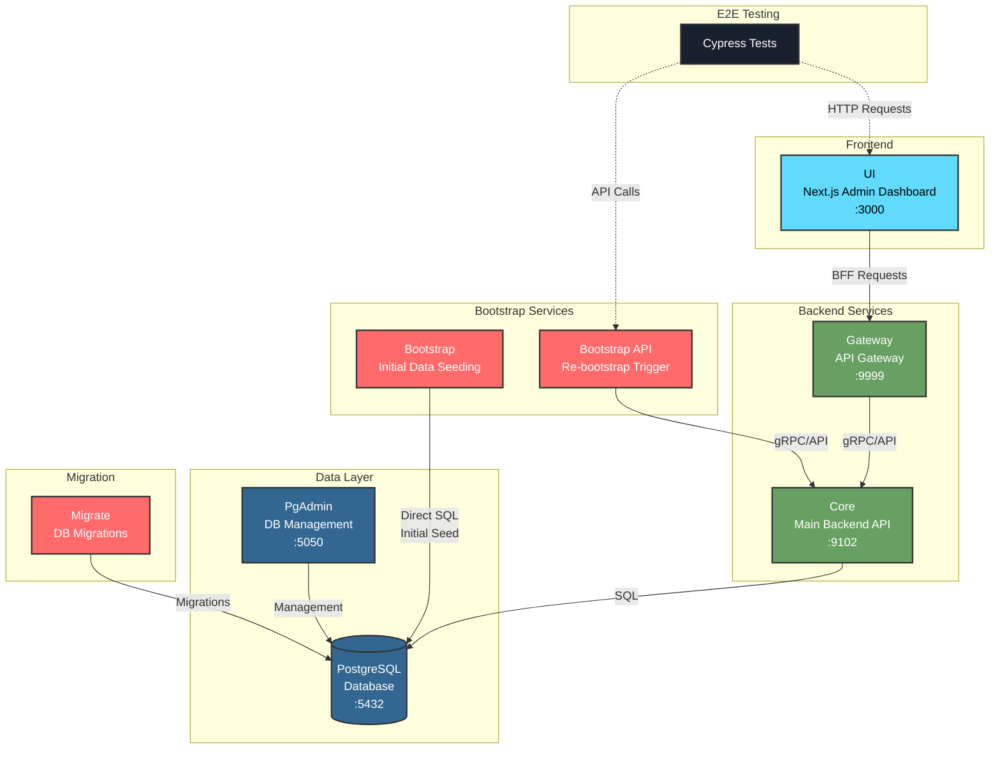

### Utro E2E Test Suite

This repository contains the end-to-end (E2E) test suite for the Utro project. The tests are designed to validate the functionality and performance of the Utro application across various scenarios.

### Getting Started

To start the backend application execute the following command in the terminal:

```bash
docker compose up
```

### Services

The docker compose runs the following services:

- **core**: The main backend api
- **gateway**: The api gateway for the UI to use
- **ui**: Next.js react application admin dashboard
- **bootstrap**: A service that bootraps the database with some initial data for testing purposes and then exists
- **migrate**: An instance of the core service that runs only the database migrations and then exits
- **bootstrap-api**: An instance of the bootstrap service that exposes an api to trigger the re-bootstrapping process on demand it will restart the database to it's initial state
- **postges**: The postgres database instance
- **pgadmin**: A web interface for managing the postgres database

### Architecture



### Accessing the application

Open your browser and navigate to `http://localhost:3000` to access the Utro admin dashboard. You can use the following credentials to log in:

- **Username**: admin
- **Password**: Password1!

If you'd like to log in as non admin user you can use any other user from the `users` table with the same password

### Running Tests

To run the E2E tests, execute the following command in the terminal:

```bash
pnpm install
pnpm run test
```

### Contributing

We use a version of the page object pattern for the cypress except instead of focusing on pages we focus on components also.
Please ensure that you write component objects. Create reusable strongly typed typescript functions for interacting with the components in the tests. This will help maintain the readability and maintainability of the test suite.
Ensure that test flakiness is minimized. Do not use arbitrary waits in the tests.
Feel free to refactor and improve the existing tests and component objects as needed.
The example provided is not perfect, so I'm open to suggestions and improvements on the structure of the tests and the component objects.

Any hacky and hard to do locators should be flagged with a TODO comment
so that UI developers can later add better locators.

Any bugs found in the application should be reported in the issue tracker.
Any questions regarding the application behavior should be asked in the team chat.

**GL&HF!**
